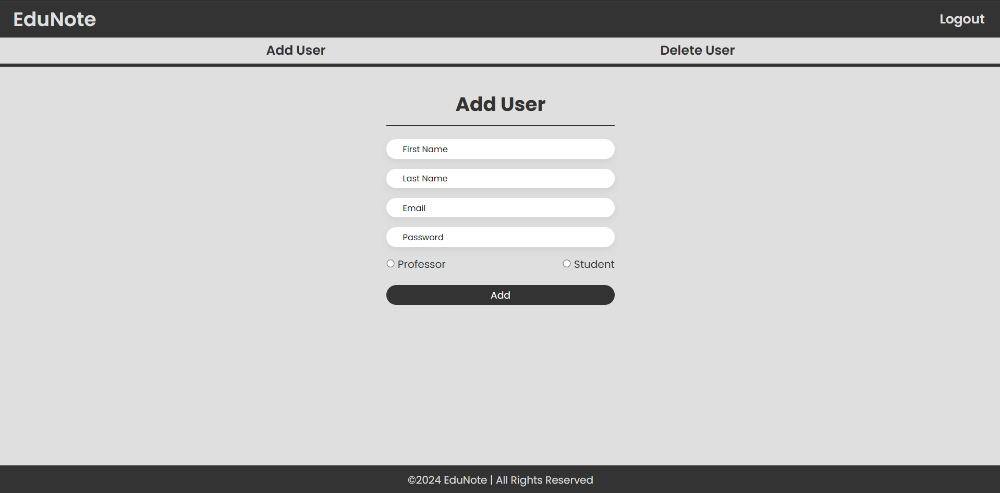
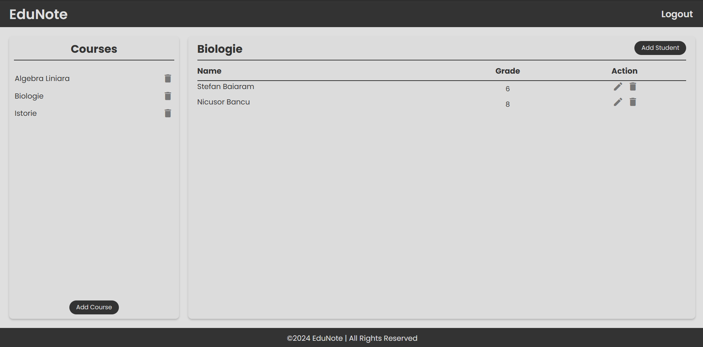
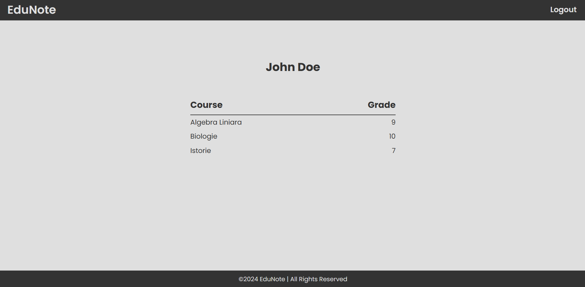

# EduNote - Student Grading System

## Description

EduNote is an application for managing student grades.
It features a dynamic frontend built with HTML, CSS, and JavaScript, and a robust backend in C++ using Crow framework.
For admin users, they can add and remove student and professors. Professors have the posibility to create and delete courses,
to add and remove students from courses and to edit students grades. And students can view the grades from all courses they are enrolled in.

## Technologies

-   **Frontend**: HTML, CSS, JavaScript
-   **Backend**: C++ (Crow, SOCI with PostgreSQL, libsodium)
-   **Dependency Management**: vcpkg

## Setup

-   Install required libraries with vcpkg: './vcpkg install crow soci[postgresql] libsodium'
-   Rename .env.example to .env and fill in database details. Run commands from .sql to create tabels for application
-   Build and run tha application. Open browser at http://localhost:18080
